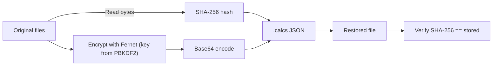

<p align="center">
  
</p>

<h1 align="center">Ransomware Technique Simulator</h1>
<p align="center">
  <i>Educational Windows red-team lab for file encryption/decryption with Fernet + PBKDF2</i>
</p>

<p align="center">
  <a href="https://github.com/UserAaronVzla/Encryption_Simulator_Tool"></a>
  
  
  
  
  
</p>


## Table of Contents
- [Overview](#overview)
- [Features](#features)
- [Architecture](#architecture)
- [Objective](#objective)
- [Quick Demo](#quick-demo)
- [Installation](#installation)
- [Usage](#usage)
- [Data Format](#data-format-calcs)
- [Use Cases](#use-cases)
- [Scope & Ethics](#scope--ethics)
- [Cryptography & Key Management](#cryptography--key-management)
- [Operational Notes](#operational-notes)
- [Troubleshooting](#troubleshooting)
- [Potential Extension](#potential-extensions)
- [License](#license)


## Overview
This project is my Windows-first red-team exercise to replicate common ransomware file-level behaviors (encrypt, store metadata, restore, verify) in a safe lab. It helps me validate crypto flows and generate realistic artifacts for blue-team testing.


## Features
- 🔐 Fernet (AES + HMAC) with PBKDF2-HMAC-SHA256 key derivation
- 🧾 Per-file JSON sidecar: `*.calcs` (hash, salt, encrypted + base64 content)
- ✅ Post-restore SHA-256 verification
- 🪟 Windows-friendly CLI and paths
- 🧪 Reversible workflow for safe demonstrations


## Architecture


## Objective
My goal is to emulate the technical steps a typical ransomware operator performs on disk, **without** any persistence, lateral movement, or network/C2, so I can:

- Understand the crypto and file-handling details end-to-end.
- Reproduce realistic artifacts for blue-team validation and detection tuning.
- Keep the workflow fully reversible for safe demonstrations.

---
## Quick Demo
**Prereqs**: Python 3.10+, `pip install -r requirements.txt` (see #Installation)
```powershell
# 1) Prepare a tiny lab with two test files
$lab = "C:\LAB\crypto"
$out = "C:\LAB\restored"
New-Item -ItemType Directory -Force -Path $lab | Out-Null
Set-Content "$lab\hello.txt" 'hello ransomware lab'
Set-Content "$lab\notes.md"  '# demo file'

# Optional: preview the folder before encryption
Get-ChildItem $lab

# 2) Encrypt the folder (creates *.calcs next to originals)
python encrypt_files.py "$lab" "MyStrongPass!"

# 3) Inspect results (you should see *.calcs files)
Get-ChildItem $lab

# Optional: peek at the JSON payload (first lines only)
Get-Content "$lab\hello.txt.calcs" -TotalCount 20

# 4) Decrypt to a separate output directory and verify integrity
python decrypt_files.py "$lab" "$out" "MyStrongPass!"

# 5) Show restored files
Get-ChildItem $out

# 6) Independent integrity check (hashes must match)
$h1 = (Get-FileHash "$lab\hello.txt" -Algorithm SHA256).Hash
$h2 = (Get-FileHash "$out\hello.txt" -Algorithm SHA256).Hash
"`nOriginal: $h1"
"Restored: $h2"
if ($h1 -eq $h2) { "Integrity: OK ✅" } else { "Integrity: MISMATCH ❌" }
```

### What you should see
- After step **2**, `hello.txt.calcs` and `notes.md.calcs` appear in `$lab`.
- After step **4**, the original files are reconstructed in `$out`.
- Step **6** prints identical SHA-256 hashes and `Integrity: OK ✅`.
> **Tip**: paths with spaces must be quoted (`"C:\My Folder\Folder"`).


### (Optional) Bash/Linux/macOS
```Bash
LAB="$HOME/lab/crypto"
OUT="$HOME/lab/restored"
mkdir -p "$LAB" "$OUT"
printf 'hello ransomware lab\n' > "$LAB/hello.txt"
printf '# demo file\n' > "$LAB/notes.md"

python encrypt_files.py "$LAB" MyStrongPass!
python decrypt_files.py "$LAB" "$OUT" MyStrongPass!

sha256sum "$LAB/hello.txt" "$OUT/hello.txt"
# The two hashes should be identical
```

## Installation
```PowerShell
python -m venv .venv
.\.venv\Scripts\Activate.ps1
pip install -r requirements.txt
```

## Usage
Encrypt
```PowerShell
python encrypt_files.py C:\Path\To\LabFolder [optional_password]
```

Decrypt
```PowerShell
python decrypt_files.py C:\Path\To\LabFolder [optional_output_folder] [optional_password]
```

> Restores files from `.calcs` and verifies the integrity by recomputing the SHA-256.

---
### Data Format (`*.calcs`)
Each `.calcs` is JSON. Example:

```JSON
{
  "filehash": "HASHINHEX",
  "filecontents": "SOMEBASE64",
  "salt": "BASE64_SALT",
}
```
> (If iterations differ in your environment, the script’s value is authoritative.)

---
# Use Cases
- **Red-team** practice for mass encryption behavior
- **Blue-team** detection and tuning (sidecar artifacts, I/O bursts)
- **Educational** crypto lab for Fernet + PBKDF2


## Scope & Ethics
- **Environment:** My local, controlled **Windows** lab.
- **Data:** Only data and directories I own and intentionally select.
- **Non-goals:** No self-propagation, no privilege abuse, no registry persistence, no scheduled tasks, no external communication.

> This repository is for **education and professional practice only.**


## Cryptography & Key Management
- **Cipher**: Fernet (AES + HMAC; authenticated encryption).
- **KDF**: PBKDF2-HMAC-SHA256 derived from a user password.
- **Salt**: Random salt stored in the `.calcs` payload so the password is the only secret needed at restore time.
- **Integrity**: AEAD (Fernet) plus an explicit SHA-256 verification step after decryption.


## Operational Notes
- **Performance**: CPU-bound due to KDF + crypto; I keep it single-process for clarity.
- **Safety**: All operations are local; no network calls or persistence.
- **Restorability**: `.calcs` bundle includes everything needed except the password.


## Troubleshooting
- **InvalidToken** during decryption: wrong password or corrupted `.calcs`.
- **Hash mismatch** after restore: indicates tampering or truncation—re-run with the correct password and intact `.calcs`.
- **UnicodeDecodeError**: expected if you try to open binary data as text—use the decryptor.


## Potential Extensions
- `--include/--exclude` globbing for file selection.
- `--wipe` (delete originals after successful `.calcs` creation; for stricter simulations only).
- `--workers N` for parallel encryption.
- `--keyfile` mode to avoid passwords (generate/load a symmetric key).
- Progress bar and structured logging.
- Unit tests for round-trip and negative cases.


## License
Educational and professional practice only. Choose a permissive license (e.g., MIT) and retain this intent in forks.


## Social
- 📧 A.eskenazicohen@gmail.com
- 💼 [LinkedIn](https://linkedin.com/in/aaron-eskenazi-vzla)
- 🐈‍⬛ [GitHub](https://github.com/UserAaronVzla)


